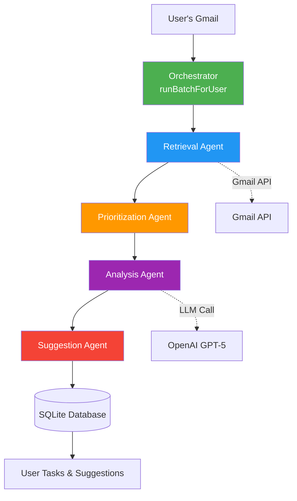
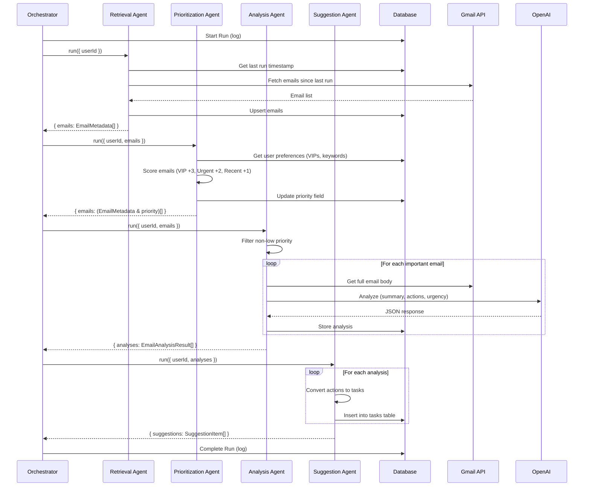

# Email Assistant - Agentic Architecture

## Core Concept: The Agent Interface

Every agent in the system follows a single, unified contract:

```typescript
export interface Agent<TInput, TOutput> {
  name: string;
  run(input: TInput): Promise<TOutput>;
}
```

**Why this matters:**
- **Composability**: Agents can be chained together easily
- **Testability**: Each agent can be tested in isolation
- **Flexibility**: Swap implementations without breaking the system
- **Type Safety**: TypeScript ensures correct data flow

## System Architecture



## Agent Pipeline Flow



## Agent Breakdown

### 1. **Retrieval Agent** (`EmailRetrievalAgent`)
**Purpose**: Fetch new emails from Gmail

**Input:**
```typescript
{
  userId: string;
  forceAll?: boolean;
}
```

**Output:**
```typescript
{
  emails: EmailMetadata[];
}
```

**What it does:**
1. Queries database for last successful run
2. Builds Gmail query: `label:INBOX after:<timestamp>`
3. Fetches up to 50 messages
4. For each message:
   - Calls Gmail API for full details
   - Extracts metadata (sender, subject, snippet, labels)
   - Inserts into `emails` table (avoiding duplicates)

**Key Logic:**
- Uses `INSERT OR IGNORE` to prevent duplicate emails
- Stores received timestamp for chronological tracking

---

### 2. **Prioritization Agent** (`PrioritizationAgent`)
**Purpose**: Score emails based on heuristics

**Input:**
```typescript
{
  userId: string;
  emails: EmailMetadata[];
}
```

**Output:**
```typescript
{
  emails: (EmailMetadata & { priority: 'high' | 'medium' | 'low' })[];
}
```

**What it does:**
1. Loads user preferences from database
2. For each email, calculates score:
   - **+3**: Sender is in VIP list
   - **+2**: Subject contains urgent keywords
   - **+1**: Email is less than 12 hours old
3. Maps score to priority:
   - `score >= 4` → **high**
   - `score >= 2` → **medium**
   - `score < 2` → **low**
4. Updates `emails.priority` in database

**Key Logic:**
- Case-insensitive keyword matching
- Configurable per-user via `preferences` JSON

---

### 3. **Analysis Agent** (`AnalysisAgent`)
**Purpose**: Use LLM to extract meaning from important emails

**Input:**
```typescript
{
  userId: string;
  emails: (EmailMetadata & { priority: string })[];
}
```

**Output:**
```typescript
{
  analyses: EmailAnalysisResult[];
}
```

**What it does:**
1. Filters out low-priority emails
2. For each important email:
   - Fetches full email body from Gmail
   - Extracts text (handles `text/plain` and multipart)
   - Sends to LLM with structured prompt
   - Parses JSON response:
     ```json
     {
       "summary": "1-2 sentence summary",
       "actions": [{ "description", "dueDate", "priority" }],
       "entities": ["project names", "people"],
       "isUrgent": true/false
     }
     ```
3. Stores analysis in `emails.analysis` field

**Key Logic:**
- Uses `gpt-5` with JSON mode for reliability
- Handles multipart MIME emails
- Base64 decoding for email bodies

---

### 4. **Suggestion Agent** (`SuggestionAgent`)
**Purpose**: Convert analysis into actionable tasks

**Input:**
```typescript
{
  userId: string;
  analyses: EmailAnalysisResult[];
}
```

**Output:**
```typescript
{
  suggestions: SuggestionItem[];
}
```

**What it does:**
1. For each analysis:
   - Loops through `actions` array
   - Creates a `SuggestionItem` for each action
   - Inserts into `tasks` table with:
     - Title from action description
     - Details from email summary
     - Priority from action or urgency flag
     - Due date if specified
2. Special case: If email is urgent but has no actions, creates a "Review Urgent Email" task

**Key Logic:**
- Links tasks to source emails via `source_email_id`
- Defaults to `status='pending'`

---

### 5. **Orchestrator** (`runBatchForUser`)
**Purpose**: Coordinate the entire pipeline

**What it does:**
1. **Logs Start**: Inserts a row in `runs` table with `status='started'`
2. **Chains Agents**: Calls each agent in sequence, passing output to next
3. **Error Handling**: Catches failures, updates run status to `'failed'`
4. **Logs Completion**: Updates run with `status='completed'` and metadata

**Key Logic:**
- Uses database transactions for run tracking
- Returns final suggestions array
- Provides observability via console logs

## Data Flow Example

Let's trace a single email through the system:

**Input Email:**
```
From: boss@company.com
Subject: URGENT: Q4 Report Due Friday
Body: Please send me the Q4 financial report by EOD Friday.
```

**Step 1: Retrieval**
```typescript
{
  id: "abc123",
  from: "boss@company.com",
  subject: "URGENT: Q4 Report Due Friday",
  snippet: "Please send me the Q4 financial...",
  receivedAt: "2025-11-22T10:00:00Z",
  labels: ["INBOX", "IMPORTANT"]
}
```

**Step 2: Prioritization**
```typescript
// Assuming boss@company.com is a VIP
score = 3 (VIP) + 2 (URGENT keyword) + 1 (recent) = 6
priority = "high"
```

**Step 3: Analysis**
```typescript
{
  emailId: "abc123",
  summary: "Boss requesting Q4 financial report by Friday EOD",
  actions: [
    {
      description: "Send Q4 financial report",
      dueDate: "2025-11-25T17:00:00Z",
      priority: "high"
    }
  ],
  entities: ["Q4", "financial report"],
  isUrgent: true
}
```

**Step 4: Suggestion**
```typescript
{
  type: "task",
  title: "Send Q4 financial report",
  details: "From email summary: Boss requesting Q4 financial report by Friday EOD",
  sourceEmailId: "abc123",
  priority: "high"
}
```

**Final Output in Database:**
```sql
INSERT INTO tasks (user_id, source_email_id, title, description, due_date, priority, status)
VALUES ('user-123', 'abc123', 'Send Q4 financial report', 'From email...', '2025-11-25 17:00:00', 'high', 'pending');
```

## Why This Architecture Works

### 1. **Separation of Concerns**
Each agent has a single responsibility:
- Retrieval: I/O with Gmail
- Prioritization: Heuristic scoring
- Analysis: LLM processing
- Suggestion: Task creation

### 2. **Testability**
You can test each agent independently:
```typescript
const mockEmails = [{ id: '1', from: 'vip@example.com', ... }];
const result = await prioritizationAgent.run({ userId: 'test', emails: mockEmails });
// Assert result.emails[0].priority === 'high'
```

### 3. **Extensibility**
Want to add a new agent? Just implement the interface:
```typescript
class SpamFilterAgent implements Agent<EmailInput, EmailOutput> {
  name = 'SpamFilterAgent';
  async run(input: EmailInput): Promise<EmailOutput> {
    // Your logic here
  }
}
```

### 4. **Type Safety**
TypeScript ensures you can't pass wrong data:
```typescript
// ✅ Correct
prioritizationAgent.run({ userId: 'abc', emails: [...] });

// ❌ Compile error - missing 'emails'
prioritizationAgent.run({ userId: 'abc' });
```

### 5. **Observability**
Each agent logs its actions:
```
[EmailRetrievalAgent] Starting retrieval for user abc...
[EmailRetrievalAgent] Found 12 messages.
[PrioritizationAgent] Prioritizing 12 emails...
[PrioritizationAgent] Completed. High: 3, Medium: 5, Low: 4
```

## Future Enhancements

The agent architecture makes it easy to add:
- **Caching Agent**: Reduce API calls
- **Deduplication Agent**: Merge similar emails
- **Context Agent**: Learn from user feedback
- **Notification Agent**: Send alerts for urgent tasks
- **Scheduling Agent**: Optimize task timing

Each would just implement `Agent<TInput, TOutput>` and slot into the pipeline.
