# Investment Scout - Deal Flow Documentation

## Overview

The Investment Scout is an AI-powered investment deal flow system that automatically monitors Gmail for investment opportunities from syndicates and platforms like AngelList, analyzes them using AI agents, and presents curated deals through a React frontend.

---

## Architecture Diagram

```mermaid
flowchart TB
    subgraph EmailIngestion["📧 Email Ingestion"]
        Gmail[Gmail API]
        EmailMonitor[email_monitor.py]
    end
    
    subgraph AnalysisPipeline["🧠 AI Analysis Pipeline"]
        Research[research_agent.py<br/>Exa/Tavily API]
        Scorer[scorer.py<br/>Signal Score]
        Analyzer[analyzer.py<br/>GPT-4 Verdict]
    end
    
    subgraph DataLayer["💾 Data Layer"]
        DB[(SQLite DB)]
        Models[models.py<br/>Pydantic Schemas]
        Database[database.py<br/>CRUD Operations]
    end
    
    subgraph API["🔌 API Layer"]
        FastAPI[server.py<br/>REST + WebSocket]
    end
    
    subgraph Frontend["⚛️ React Frontend"]
        InvestmentPanel[InvestmentPanel.tsx]
        DealCard[DealCard]
        DealModal[DealModal]
    end
    
    Gmail --> EmailMonitor
    EmailMonitor --> Database
    EmailMonitor --> AnalysisPipeline
    Research --> Analyzer
    Scorer --> Analyzer
    Analyzer --> Database
    Database <--> DB
    Models <--> Database
    Database <--> FastAPI
    FastAPI <--> InvestmentPanel
    InvestmentPanel --> DealCard
    InvestmentPanel --> DealModal
```



---

## Core Components

### 1. Data Models (`models.py`)

Defines the Pydantic schemas for structured investment data:

| Model | Purpose |
|-------|---------|
| `Deal` | Complete investment opportunity with all fields |
| `DealSummary` | Lightweight version for list views |
| `InvestmentTerms` | Min check, valuation, round type, deadline |
| `InvestmentVerdict` | AI-generated analysis with signal score |
| `DealMetric` | Individual metric (label, value, sentiment) |
| `Competitor` | Competitor comparison data |
| `DeckInsights` | Extracted pitch deck data |

**Key Enums:**
- `ActionType`: `MUST READ`, `INTERESTING`, `PASS`
- `DealStatus`: `pending`, `invested`, `passed`, `saved`
- `Sentiment`: `positive`, `neutral`, `negative`

---

### 2. Email Monitor (`email_monitor.py`)

**Purpose:** Monitors Gmail for investment opportunity emails.

#### Process Flow:


#### Key Functions:

| Function | Description |
|----------|-------------|
| `get_gmail_service()` | Authenticates with Gmail using existing tokens |
| `build_investment_query()` | Creates Gmail search query for investment emails |
| `fetch_investment_emails()` | Fetches emails matching investment criteria |
| `parse_email()` | Parses Gmail API response into structured data |
| `is_investment_email()` | Validates if email is an investment opportunity |
| `extract_company_info()` | Extracts company name, website, round type |
| `extract_terms()` | Extracts min check, valuation, deadline |
| `run_email_check()` | Main entry point for email scanning |

#### Investment Filters:

**Senders monitored:**
- `angel.co`, `angellist.com`, `squad`, `syndicate`

**Keywords scanned:**
- `investment opportunity`, `deal flow`, `allocation`, `syndicate`, `minimum check`, `carry`, `pro-rata`, `invest now`, `closing soon`, `last call`

---

### 3. Research Agent (`research_agent.py`)

**Purpose:** Red Team research to validate/invalidate investment claims.

#### Agent Implementations:

| Agent | API | Priority |
|-------|-----|----------|
| `ExaResearchAgent` | Exa Neural Search | Primary |
| `TavilyResearchAgent` | Tavily Search | Fallback |

#### Research Categories:

```python
CompanyResearch:
    validation: List[ResearchResult]   # LinkedIn, founder background
    sentiment: List[ResearchResult]    # Reddit, HN discussions  
    competitors: List[ResearchResult]  # Alternative products
    news: List[ResearchResult]         # Recent funding, layoffs
    website_content: Optional[str]     # Company website content
```

#### Parallel Research Queries:

1. **Founder Validation**: `{company} founder CEO background`
2. **User Sentiment**: `{company} site:reddit.com OR site:news.ycombinator.com`
3. **Competitors**: `Alternatives to {company} pricing comparison`
4. **News**: `{company} funding layoffs 2024 2025`

---

### 4. Signal Score Calculator (`scorer.py`)

**Purpose:** Calculates a 0-100 "Signal Score" using weighted factors.

#### Scoring Weights:

| Signal | Weight | Type |
|--------|--------|------|
| Top-tier VC (a16z, Sequoia, etc.) | +20 | Positive |
| Revenue mentioned (ARR/MRR) | +15 | Positive |
| Prior exit (founder has exits) | +15 | Positive |
| Growth metrics (YoY, 2x, etc.) | +10 | Positive |
| Large market (TAM, billion) | +10 | Positive |
| High burn rate | -20 | Negative |
| Low runway (<6 months) | -15 | Negative |
| Funded competitor found | -10 | Negative |
| Per red flag found | -5 | Negative |
| No concrete metrics | -10 | Negative |

#### Score → Action Mapping:

```python
score >= 80  →  "MUST READ"
score >= 60  →  "INTERESTING"  
score < 60   →  "PASS"
```

#### Top-Tier VCs Recognized:

`a16z`, `sequoia`, `benchmark`, `accel`, `greylock`, `lightspeed`, `founders fund`, `tiger global`, `index ventures`, `bessemer`, `general catalyst`, `y combinator`, `khosla`, `kleiner`, `ggv`, `insight partners`

---

### 5. AI Analyzer (`analyzer.py`)

**Purpose:** Generates AI verdicts using GPT-4.

#### Analysis Pipeline:


#### GPT-4 Output Structure:

```json
{
    "one_line_pitch": "2-sentence company summary",
    "executive_summary": "3-4 sentence analysis",
    "bull_case": ["reason 1", "reason 2", "reason 3"],
    "bear_case": ["risk 1", "risk 2", "risk 3"],
    "metrics": [
        {"label": "ARR", "value": "$X", "sentiment": "positive"}
    ],
    "competitors": [
        {"name": "Competitor", "differentiation": "How target differs"}
    ]
}
```

---

### 6. Database Layer (`database.py`)

**Purpose:** SQLite storage with deal hash deduplication.

#### Schema:

```sql
CREATE TABLE deals (
    id TEXT PRIMARY KEY,
    deal_hash TEXT UNIQUE,        -- MD5 hash for deduplication
    company_name TEXT NOT NULL,
    logo_url TEXT,
    website TEXT,
    industry TEXT,
    stage TEXT,
    founders_json TEXT,
    terms_json TEXT,
    deck_insights_json TEXT,
    verdict_json TEXT,
    email_id TEXT,
    email_subject TEXT,
    email_from TEXT,
    email_snippet TEXT,
    created_at TEXT,
    updated_at TEXT,
    status TEXT DEFAULT 'pending'
)
```

#### Key Functions:

| Function | Description |
|----------|-------------|
| `get_deal_hash()` | Generate MD5 hash from `company:round` |
| `deal_exists()` | Check if deal already exists |
| `save_deal()` | Insert or replace deal |
| `get_deals()` | List deals with optional status filter |
| `get_deal()` | Get full deal by ID |
| `update_deal_status()` | Update status (invested/passed/saved) |
| `update_deadline()` | Update deadline for existing deal |

---

### 7. FastAPI Server (`server.py`)

**Purpose:** REST API + WebSocket for real-time notifications.

#### REST Endpoints:

| Method | Endpoint | Description |
|--------|----------|-------------|
| `GET` | `/health` | Health check |
| `GET` | `/opportunities` | List deals (optional status filter) |
| `GET` | `/opportunities/{id}` | Get full deal details |
| `POST` | `/opportunities/{id}/status` | Update deal status |
| `POST` | `/check-emails` | Manually trigger email check |
| `POST` | `/test-deal` | Create mock deal for testing |

#### WebSocket:

- **Endpoint:** `/ws`
- **Events:** `new_opportunities` - Broadcasts when new deals are found
- **Keep-alive:** Ping/pong heartbeat

#### Background Task:

Runs email check every **12 hours** automatically.

---

## Testing

### Test Deal Endpoint (`/test-deal`)

The `/test-deal` endpoint creates a mock deal for UI testing without requiring actual email:

```python
POST /test-deal

Response:
{
    "success": true,
    "deal_id": "uuid",
    "company_name": "TechStartup AI",
    "message": "Test deal created and broadcast to connected clients"
}
```

**Mock Deal Contents:**
- Company: "TechStartup AI"
- Industry: AI/ML
- Stage: Seed
- Min Check: $5,000
- Valuation: $15M cap
- Signal Score: 78 (INTERESTING)
- Lead Investor: a16z Scout

### Analyzer Test (`if __name__ == "__main__"`)

```bash
cd investment-scout
python analyzer.py
```

Creates a test deal and runs through the full analysis pipeline.

### Research Agent Test

```bash
python research_agent.py
```

Runs research on "OpenAI" with founder "Sam Altman" and prints summary.

### Email Monitor Test

```bash
python email_monitor.py
```

Triggers a single email check and processes any found deals.

---

## Agents Created

### 1. Research Agent

**File:** `research_agent.py`

**Purpose:** Performs Red Team research on investment targets to validate claims and find risks.

**Capabilities:**
- Founder background validation via LinkedIn
- User sentiment analysis from Reddit/HN
- Competitor discovery and comparison
- Recent news monitoring (funding, layoffs)
- Website content extraction

**APIs:** Exa (primary) or Tavily (fallback)

### 2. Scoring Agent

**File:** `scorer.py`

**Purpose:** Deterministic scoring algorithm that calculates a "Signal Score" (0-100) based on heuristics.

**Logic:**
- Starts at 50 (neutral)
- Adds/subtracts based on weighted positive/negative signals
- Maps final score to action: MUST READ / INTERESTING / PASS

### 3. Analysis Agent

**File:** `analyzer.py`

**Purpose:** GPT-4 powered verdict generator that synthesizes all research into a final investment verdict.

**Workflow:**
1. Orchestrates research agent
2. Calculates signal score
3. Prompts GPT-4 with all data
4. Returns structured verdict

---

## Frontend Integration

### InvestmentPanel.tsx

Main React component for browsing deals:

- **Filter tabs:** Pending, Saved, All
- **Deal grid:** Responsive grid of `DealCard` components
- **Deal modal:** Full details with Invest/Pass/Save actions
- **API calls:** Fetches from `http://localhost:3003`

### TypeScript Types (`investmentTypes.ts`)

Mirrors Python Pydantic models for type safety:
- `Deal`, `DealSummary`, `DealMetric`, `Competitor`
- `InvestmentVerdict`, `InvestmentTerms`
- `NewDealNotification`

---

## Configuration

### Environment Variables

```bash
# Required
OPENAI_API_KEY=sk-...

# Research (one required)  
EXA_API_KEY=...
TAVILY_API_KEY=...

# Gmail (uses existing tokens)
GMAIL_TOKEN_PATH=../email-assistant/agents/gmail/token.json
GMAIL_CREDENTIALS_PATH=../email-assistant/agents/gmail/credentials.json

# Optional
INVESTMENT_SCOUT_PORT=3003
```

---

## Running the System

```bash
# Start backend
cd investment-scout
./start.sh
# or: python server.py

# Server runs on http://localhost:3003
```

The system will:
1. Initialize SQLite database
2. Start background email checker (runs every 12 hours)
3. Expose REST API and WebSocket endpoints
4. Broadcast new deals to connected WebSocket clients
